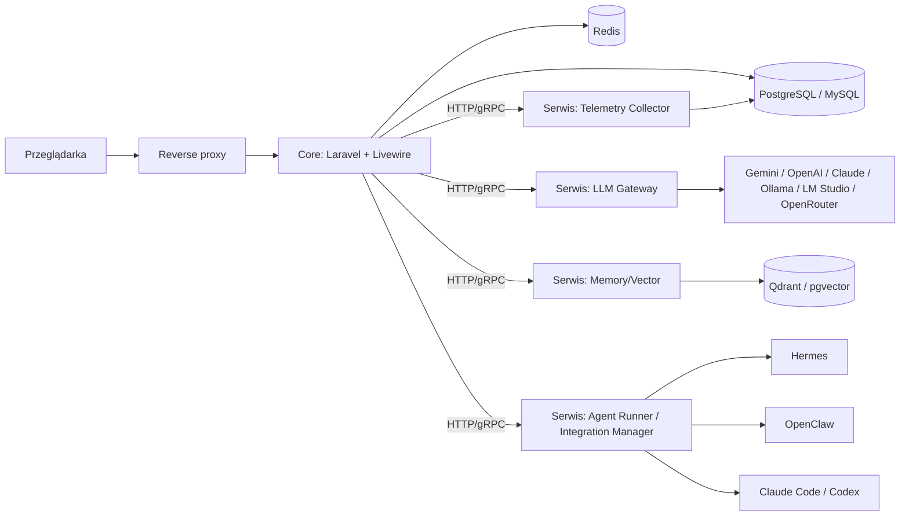

# AgentHub – Specyfikacja projektu dla AI-dewelopera

> **Zmiana:** dodano automatyczne tworzenie instancji Hermes Agent i OpenClaw z panelu jako osobnych mikroserwisów (sekcje 9.5 i 13.5).

> **Przeznaczenie dokumentu:** Ten plik jest kompletną specyfikacją do przekazania AI (np. Claude Code, Codex), które ma zbudować aplikację. Zawiera wymagania, architekturę, model danych, układ UI, kryteria akceptacji i plan etapów. Nazwa robocza projektu: **AgentHub** (można zmienić w jednym miejscu: `config/agenthub.php`).

---

## 0. Zasady pracy dla AI wykonującego to zadanie

1. Czytaj całość dokumentu przed rozpoczęciem pracy. Realizuj **etapami** z sekcji 22; po każdym etapie uruchom testy.
2. Nie wymyślaj API zewnętrznych narzędzi (Hermes, OpenClaw itd.). Tam gdzie specyfikacja każe „zweryfikować", sprawdź oficjalną dokumentację/repozytorium danego narzędzia i zapisz ustalenia w `docs/integrations/<nazwa>.md`. Do czasu weryfikacji implementuj adapter jako **warstwę z kontraktem** (sekcja 9) i **testowym sterownikiem mock**.
3. Każda zmiana funkcjonalna = wpis w `CHANGELOG.md` (sekcja 20) + test.
4. Kod: PHP 8.3+, Laravel (aktualna stabilna wersja LTS/stable), PSR-12, Laravel Pint, PHPStan (level 6+), Pest/PHPUnit.
5. Wszystkie teksty UI po polsku, z użyciem plików tłumaczeń (`lang/pl`, `lang/en`) – bez zahardkodowanych stringów.
6. Sekrety (klucze API, tokeny) **zawsze szyfrowane** w bazie (`encrypted` cast) i nigdy nie logowane.

---

## 1. Cel i zakres

AgentHub to webowa platforma do **tworzenia, konfigurowania, uruchamiania i monitorowania agentów AI** z jednego interfejsu. Platforma:

- integruje się domyślnie z runtime'ami agentów **Hermes Agent** i **OpenClaw** (oraz narzędziami Claude Code, Codex),
- łączy się z dostawcami modeli (Gemini, OpenAI, Claude, Ollama, LM Studio, OpenRouter itd.),
- zapewnia współdzieloną **pamięć wektorową** z możliwością przeglądania i edycji (styl Obsidian),
- pokazuje dashboard: aktywni agenci, zużycie tokenów, szybkość, koszty,
- ma okno czatu do komunikacji z agentami,
- jest **modularna i rozszerzalna** – nowe moduły dodaje się bez modyfikacji rdzenia,
- ma instalator pierwszego uruchomienia, auto-update i testy zgodności.

### Poza zakresem (v1)
Marketplace modułów publiczny, billing/SaaS multi-tenant, aplikacje mobilne natywne. Integracja z Antigravity – **odłożona**, nie projektować w v1 (architektura adapterów pozwoli dodać ją później). Jev – **usunięty z projektu**.

### Założenia i punkty do potwierdzenia
| # | Założenie | Uwagi |
|---|-----------|-------|
| A1 | „Hermes" = **Hermes Agent**, „OpenClaw" = **OpenClaw** (potwierdzone przez zamawiającego) | Zweryfikować oficjalne metody instalacji i API każdego z nich |
| A2 | Silnik bazy głównej: **PostgreSQL** (zalecany) lub MySQL/MariaDB | Aplikacja działa na obu |
| A3 | Baza wektorowa: **Qdrant** (open source, Apache 2.0) jako domyślna; **pgvector** jako alternatywa dla PostgreSQL | Sekcja 8 – Qdrant działa niezależnie od wybranej bazy relacyjnej |
| A4 | Dane logowania admina: `admin@admin.lan` / `admin` | Aplikacja **nie wymusza** zmiany hasła (zmiana dostępna w profilu, zalecana w dokumentacji) |
| A5 | Instalacja natywna na Debian 13 (Apache + PHP-FPM) oraz Docker | Sekcja 13 |
---

## 2. Stack technologiczny

| Warstwa | Technologia |
|---------|-------------|
| Backend rdzeń | PHP 8.3+, Laravel (stable), Laravel Octane (opcjonalnie) |
| Frontend | Blade + **Livewire 3** + Alpine.js + Tailwind CSS (alternatywnie Inertia + Vue – wybrać jedno i trzymać się go) |
| Wykresy | Chart.js lub ApexCharts |
| Graf pamięci | Cytoscape.js lub D3 (widok „Obsidian-like") |
| Serwer WWW / PHP | Apache 2.4 + PHP-FPM (instalacja natywna Debian 13: PHP 8.4); Caddy/Nginx w wariancie Docker |
| Baza główna | PostgreSQL 16+ (zalecane) lub MySQL 8+ / MariaDB 11+ |
| Wektory | **Qdrant** (open source, domyślnie, działa z każdą bazą relacyjną) lub pgvector (opcjonalnie, tylko PostgreSQL) |
| Kolejki / cache | Redis + Laravel Horizon |
| Realtime | Laravel Reverb (WebSocket) lub SSE dla streamingu czatu |
| Mikroserwisy | Kontenery Docker; komunikacja HTTP/gRPC + kolejka (Redis Streams) |
| Reverse proxy | Apache (natywnie) / Caddy lub Nginx (Docker) |
| Orkiestracja | Docker Compose (v1), gotowość pod Kubernetes (v2) |
| Testy | Pest, Laravel Dusk/Playwright (E2E), PHPStan, Pint |
| CI | GitHub Actions (lint, test, build obrazów) |

---

## 3. Architektura

### 3.1 Podejście: modularny monolit + wydzielane mikroserwisy

Wymóg „moduły super dostępne" realizujemy dwustopniowo:

1. **Rdzeń (Core)** – Laravel: UI, auth, RBAC, rejestr modułów, konfiguracja, audyt.
2. **Moduły** – każdy moduł to samodzielny pakiet w `modules/<Nazwa>` z własnymi trasami, migracjami, widokami, uprawnieniami.
3. **Mikroserwisy** – ciężkie/krytyczne funkcje działają jako osobne kontenery, a rdzeń rozmawia z nimi przez kontrakt (interfejs + klient HTTP). Moduł może działać **in-process** (tryb prosty) lub **zdalnie** (tryb HA) bez zmiany kodu wywołującego.

### 3.2 Diagram logiczny



### 3.3 Mikroserwisy (wydzielane etapowo)

| Serwis | Odpowiedzialność | Dlaczego osobno |
|--------|------------------|-----------------|
| `llm-gateway` | Jednolite API do wszystkich dostawców, streaming, retry, fallback, pomiar tokenów/latencji | Skalowanie, izolacja kluczy |
| `memory-service` | Embeddingi, indeksowanie, wyszukiwanie wektorowe, graf powiązań | Obciążenie CPU/IO |
| `integration-manager` | Instalacja i **automatyczne tworzenie instancji** (provisioning) Hermes Agent/OpenClaw, start/stop, health-check, rejestr usług, proxy do ich API | Dostęp do hosta/Docker, izolacja uprawnień |
| `telemetry-collector` | Odbiór zdarzeń od agentów, agregacja metryk | Duży wolumen zapisów |

**Zasady komunikacji:**
- Synchronicznie: REST (JSON) z kontraktem OpenAPI; opcjonalnie gRPC.
- Asynchronicznie: Redis Streams / kolejki Laravela.
- Uwierzytelnianie między serwisami: krótkie tokeny JWT (HS256/EdDSA) lub mTLS; sekret w `.env`.
- Każdy serwis wystawia `/health`, `/ready`, `/metrics` (Prometheus).
- Serwis wewnętrzny napisany w dowolnym języku (rekomendacja: PHP/Laravel Zero lub Python FastAPI dla `memory-service` i `llm-gateway`), ale **kontrakt OpenAPI w `contracts/` jest źródłem prawdy**.

### 3.4 Tryby wdrożenia
- **Tryb „All-in-one"**: wszystko w jednym `docker compose up` (domyślny, szybka aktywacja).
- **Tryb „Rozproszony"**: serwisy na osobnych hostach, konfiguracja adresów w panelu i `.env`.
- **Tryb „Natywny Debian 13"**: Apache + PHP-FPM + baza + Redis + Qdrant instalowane skryptem `scripts/install-debian13.sh` (sekcja 13.4); usługi `llm-gateway`, `memory-service`, `telemetry-collector` działają **in-process** (`SERVICE_MODE=local`), a każdą z nich można później wydzielić do kontenera (`SERVICE_MODE=remote`) bez zmian w kodzie modułów.
- **Instancje integracji** (Hermes Agent, OpenClaw) działają w każdym trybie jako **osobne mikroserwisy** (oddzielna usługa systemd lub kontener) tworzone automatycznie z panelu – patrz sekcja 9.5.

---

## 4. Struktura repozytorium

```
agenthub/
├── app/                      # rdzeń Laravel
├── bootstrap/
├── config/
│   ├── agenthub.php          # nazwa, wersja, flagi
│   └── modules.php
├── contracts/                # OpenAPI/JSON Schema kontraktów mikroserwisów
├── database/
│   ├── migrations/
│   └── seeders/
│       ├── DatabaseSeeder.php
│       ├── AdminUserSeeder.php
│       ├── RolesAndPermissionsSeeder.php
│       └── DefaultProvidersSeeder.php
├── docs/
│   ├── README.md
│   ├── INSTALL.md
│   ├── ARCHITECTURE.md
│   ├── MODULES.md            # jak pisać moduły
│   ├── integrations/         # hermes.md, openclaw.md ...
│   └── api/
├── docker/
├── modules/                  # moduły (każdy samodzielny)
│   ├── Dashboard/
│   ├── Agents/
│   ├── Memory/
│   ├── Integrations/
│   ├── AiSettings/
│   ├── Users/
│   ├── Logs/
│   └── Chat/
├── services/                 # mikroserwisy
│   ├── llm-gateway/
│   ├── memory-service/
│   ├── integration-manager/
│   └── telemetry-collector/
├── scripts/
│   ├── install.sh
│   ├── install-debian13.sh   # instalator natywny (Apache, PHP, DB, Qdrant)
│   ├── update.sh
│   ├── compat-check.sh
│   └── rollback.sh
├── tests/
├── CHANGELOG.md
├── docker-compose.yml
└── .env.example
```

---

## 5. Układ interfejsu (7 bloków)

### 5.1 Schemat

```
┌──────────────┬───────────────────────────────────────────┬──────────────────┐
│  BLOK 1      │  BLOK 4                                   │  BLOK 5          │
│  Logo/ikona  │  (puste – zarezerwowane)                  │  Zalogowany      │
│  → dashboard │                                           │  użytkownik      │
├──────────────┼───────────────────────────────────────────┴──────────────────┤
│  BLOK 2      │  BLOK 6 – Menu 2 (podkategorie wybranego modułu z Menu 1)    │
│  Menu 1      ├──────────────────────────────────────────────────────────────┤
│  (moduły)    │                                                              │
│              │  BLOK 7 – Obszar roboczy (treść podkategorii / modułu)       │
│              │                                                              │
├──────────────┤                                                              │
│  BLOK 3      │                                                              │
│  Wyloguj     │                                                              │
└──────────────┴──────────────────────────────────────────────────────────────┘
```

### 5.2 Specyfikacja bloków

| Blok | Pozycja | Zawartość | Zachowanie |
|------|---------|-----------|------------|
| 1 | góra-lewo | Ikona/logo aplikacji | Klik → domyślny dashboard (`/dashboard`) |
| 2 | środek-lewo, bezpośrednio pod blokiem 1 | **Menu 1** – lista wszystkich zarejestrowanych modułów (ikona + nazwa) | Generowane dynamicznie z rejestru modułów, filtrowane uprawnieniami; aktywna pozycja podświetlona |
| 3 | dół-lewo, pod blokiem 2 | Przycisk **Wyloguj** | Przyklejony do dołu kolumny; `POST /logout` |
| 4 | góra-środek, między blokiem 1 a 5 | **Puste pole** (slot na przyszłość: wyszukiwarka, powiadomienia, breadcrumbs) | Renderowany jako `<x-slot name="topbar-center">` – moduły mogą w przyszłości wstrzykiwać treść |
| 5 | góra-prawo | Informacja o zalogowanym: avatar, imię, rola | Klik opcjonalnie → profil |
| 6 | pod blokami 4 i 5 | **Menu 2** – podkategorie aktywnego modułu z Menu 1 | Zakładki poziome; zmiana → ładuje widok w bloku 7 |
| 7 | pozostała powierzchnia | Treść widoku wybranej podkategorii lub modułu | Przewijany niezależnie; pełna szerokość |

### 5.3 Wymagania UI
- CSS Grid: kolumna lewa stała (np. 240 px, zwijana do 72 px do ikon), reszta elastyczna.
- Bloki 1–3 tworzą jedną kolumnę o pełnej wysokości widoku (`100vh`), blok 3 przyklejony do dołu.
- Motyw jasny/ciemny (przełącznik w ustawieniach użytkownika), zapamiętywany w profilu.
- Responsywność: poniżej 768 px lewa kolumna zwija się do menu „hamburger".
- Dostępność: kontrasty WCAG AA, nawigacja klawiaturą, `aria-current` na aktywnych pozycjach.
- Menu 1 i Menu 2 są **deklarowane przez moduły** (manifest), nie wpisywane na sztywno w layoucie.

---

## 6. Menu i moduły (mapa funkcjonalna)

### 6.1 Menu 1 → Menu 2 → zawartość

| Menu 1 (moduł) | Menu 2 (podkategorie) | Opis bloku 7 |
|----------------|----------------------|--------------|
| **Dashboard** (domyślny) | Przegląd · Tokeny · Wydajność · Koszty | Co aktualnie pracuje, zużycie tokenów, prędkość, błędy |
| **Agenci AI** | Aktywni (telemetria) · Wszyscy agenci · Utwórz agenta · Szablony | Podgląd działań agentów na żywo + zarządzanie |
| **Pamięć** | Eksplorator · Graf · Wyszukiwarka wektorowa · Kolekcje · Import/Eksport | Widok „co agenci odczytali" w stylu Obsidian, z edycją |
| **Integracje** | Hermes Agent · OpenClaw · Claude Code · Codex · Inne | Instalacja, status, konfiguracja, health-check |
| **Ustawienia AI** | Dostawcy · **Konta** · Modele · Pule kont i routing · Limity · Embeddingi | Konfiguracja połączeń z dostawcami modeli; **wiele kont na jednego dostawcę** |
| **Ustawienia użytkownika** | Użytkownicy · Role i uprawnienia · Mój profil · Bezpieczeństwo | Tworzenie użytkowników i zarządzanie dostępem |
| **Logi** | Audyt użytkowników · Aktywność agentów · Zdarzenia AI · Systemowe | Kto, co, kiedy – z filtrowaniem i eksportem |
| **Czat** (okno globalne) | Rozmowy · Nowa rozmowa · Archiwum | Komunikacja z agentami (dostępne też jako wysuwany panel) |

> Czat ma być dostępny zarówno jako pozycja Menu 1, jak i jako pływający panel (przycisk w prawym dolnym rogu bloku 7).

---

## 7. Szczegóły modułów

### 7.1 Dashboard
**Cel:** jedno miejsce z odpowiedzią „co się dzieje teraz".

Widżety (każdy jako osobny komponent Livewire, odświeżany przez WebSocket/polling co 5 s):
- **Aktywni agenci** – liczba, lista ze statusem (idle / working / error / offline), bieżące zadanie.
- **Zużycie tokenów** – wykres (godzina/dzień/tydzień/miesiąc), podział na dostawcę, **konto**, model, agenta; tokeny wejściowe vs wyjściowe.
- **Prędkość** – tokeny/s, latencja do pierwszego tokena (TTFT), p50/p95 latencji, per dostawca.
- **Koszty** – szacowany koszt (cennik per model konfigurowalny w tabeli `model_pricing`).
- **Zdrowie integracji** – Hermes Agent/OpenClaw/serwisy: zielony/żółty/czerwony.
- **Ostatnie zdarzenia** – 10 ostatnich wpisów z logu.
- **Błędy i limity** – rate-limity dostawców, nieudane wywołania.

### 7.2 Agenci AI
**Widok domyślny (Aktywni):** karty/tabela agentów z telemetrią w czasie rzeczywistym: status, aktualne zadanie, ostatnie narzędzia, zużyte tokeny, czas działania, ostatnie 20 zdarzeń (strumień).

**Konfiguracja agenta (formularz tworzenia/edycji):**

| Pole | Opis |
|------|------|
| Nazwa | Unikalna, czytelna (`name`) + `slug` |
| Opis / rola | Krótki opis przeznaczenia |
| Avatar / kolor | Identyfikacja wizualna |
| Runtime | Hermes Agent / OpenClaw / Claude Code / Codex / Natywny (przez LLM Gateway) |
| Model i konto | Dostawca + model (z Ustawień AI) oraz **konto** (konkretne konto albo **pula kont** ze strategią – sekcja 10.4); opcjonalny model zapasowy |
| System prompt / cechy | Osobowość, ton, instrukcje, parametry (temperatura, max tokens) |
| **Dostęp do pamięci** | Brak / Odczyt / Odczyt+Zapis; wybór kolekcji pamięci; zakres (prywatna agenta, współdzielona, globalna) |
| **Dostęp do internetu** | Wł./Wył.; opcjonalna lista dozwolonych domen (allowlist) |
| **Skille / narzędzia** | Wielokrotny wybór z rejestru skilli (sekcja 7.2.1) |
| Limity | Maks. tokenów/dzień, maks. kosztu/dzień, maks. równoległych zadań |
| Uprawnienia użytkowników | Kto może używać / edytować agenta |
| Status | Aktywny / wstrzymany |

Akcje: utwórz, edytuj, duplikuj, start/stop, usuń (soft delete), eksport/import konfiguracji (JSON/YAML).

#### 7.2.1 Skille
- Rejestr `skills`: nazwa, opis, typ (`tool` / `mcp` / `prompt` / `workflow`), definicja (JSON Schema wejścia/wyjścia), wymagane uprawnienia, wersja.
- Skille mogą pochodzić z modułów (rejestracja w manifeście), z integracji (np. skille Hermesa) lub być dodane ręcznie.
- Agent ma relację wiele-do-wielu ze skillami, z możliwością nadpisania konfiguracji per agent.

### 7.3 Pamięć (styl Obsidian)
**Cel:** przejrzysty, edytowalny wgląd w to, co agenci wiedzą i co odczytali.

Funkcje:
- **Eksplorator** – drzewo kolekcji/folderów i notatek; podgląd Markdown; edycja inline (edytor MD); historia wersji notatki.
- **Graf** – węzły = notatki/fakty, krawędzie = linki `[[wikilink]]`, podobieństwo wektorowe, odwołania agentów; filtrowanie po agencie/kolekcji/czasie.
- **Panel „co agent odczytał"** – dla wybranego agenta/zadania lista wpisów pamięci użytych w kontekście (z wynikiem podobieństwa i znacznikiem czasu).
- **Wyszukiwarka** – semantyczna (wektorowa) + pełnotekstowa (hybryda).
- **Kolekcje** – tworzenie, uprawnienia, polityka retencji.
- **Import/Eksport** – import plików `.md`/`.txt`/PDF, eksport do ZIP z plikami Markdown (kompatybilny z vaultem Obsidian).
- Każda edycja przez człowieka lub agenta jest logowana (kto, kiedy, diff) i wersjonowana.
- Notatka ma: tytuł, treść MD, tagi, metadane YAML (frontmatter), źródło (człowiek/agent/import), embedding.

### 7.4 Integracje
Patrz sekcja 9 (szczegółowo). Widok bloku 7 dla integracji: karta statusu, przyciski **Zainstaluj / Uruchom / Zatrzymaj / Restart / Test połączenia**, konfiguracja, logi runtime'u, wersja i dostępna aktualizacja. Dla Hermes Agent i OpenClaw dodatkowo zakładka **Instancje** z kreatorem **„Utwórz instancję"** (sekcja 9.5): lista instancji ze statusem, CPU/RAM, akcjami cyklu życia i logami na żywo.

### 7.5 Ustawienia AI
Patrz sekcja 10.

### 7.6 Ustawienia użytkownika
- CRUD użytkowników (imię, e-mail, hasło, status aktywny/zablokowany).
- **Role** (domyślnie: `admin`, `operator`, `viewer`) i **uprawnienia granularne** (np. `agents.create`, `memory.edit`, `integrations.manage`, `logs.view`, `settings.ai.manage`, `users.manage`).
- Uprawnienia per zasób (np. dostęp do konkretnego agenta/kolekcji pamięci).
- Profil: motyw, język, zmiana hasła, 2FA (TOTP), tokeny API osobiste.
- Implementacja: `spatie/laravel-permission` + policies.

### 7.7 Logi
- **Audyt użytkowników** – logowania, zmiany konfiguracji, CRUD (kto, co, kiedy, IP, diff przed/po).
- **Aktywność agentów** – uruchomienia zadań, wywołania narzędzi, odczyty/zapisy pamięci, zapytania internetowe.
- **Zdarzenia AI** – wywołania modeli (dostawca, model, tokeny, latencja, status; opcjonalnie treść – konfigurowalne ze względu na prywatność).
- **Systemowe** – błędy, aktualizacje, health-checki.
- Filtry: czas, aktor (użytkownik/agent/system), typ, poziom, szukaj; eksport CSV/JSON; retencja konfigurowalna.
- Wpisy **niemodyfikowalne** (append-only; brak edycji/usuwania z UI; opcjonalnie łańcuch haszy dla integralności).

### 7.8 Czat
- Rozmowy z wybranym agentem (lub kilkoma – tryb „grupowy").
- Streaming odpowiedzi (SSE/WebSocket), renderowanie Markdown i bloków kodu, wskaźnik „agent pisze/pracuje".
- Widoczne wywołania narzędzi i użycie pamięci (zwijane szczegóły).
- Załączniki (pliki tekstowe, obrazy – jeśli model wspiera).
- Historia rozmów, wyszukiwanie, archiwizacja, eksport.
- Przerwanie generowania, regeneracja, edycja wiadomości użytkownika.
- Każda wiadomość loguje tokeny i latencję (zasila Dashboard).

---

## 8. Baza danych i pamięć wektorowa

### 8.1 Silniki
- **Baza relacyjna:** PostgreSQL (zalecane) lub MySQL/MariaDB – dane aplikacji, użytkownicy, logi, metadane pamięci.
- **Baza wektorowa – domyślnie Qdrant** (open source, licencja Apache 2.0): osobna usługa, działa z każdą bazą relacyjną, ma filtrowanie po metadanych, snapshoty i API REST/gRPC. Dzięki temu wybór MySQL vs PostgreSQL nie ogranicza pamięci wektorowej.
- **Alternatywa – pgvector** (open source): rozszerzenie PostgreSQL, wektory w tej samej bazie (kolumny `vector(N)`, indeksy HNSW). Dostępne tylko z PostgreSQL.
- Warstwa abstrakcji: interfejs `VectorStore` z implementacjami `QdrantStore`, `PgVectorStore`, `NullStore` (testy). Wybór przez `VECTOR_DRIVER=qdrant|pgvector` w `.env`. Można w przyszłości dodać kolejne open-source'owe sterowniki (np. Milvus, Weaviate).
- Przy Qdrant w tabeli `memory_chunks` zapisujemy tekst i `vector_id` (punkt w Qdrant); przy pgvector – wektor w kolumnie `embedding`.
- Wymiar embeddingów zapisywany per kolekcja (zmiana modelu embeddingów = reindeksacja w kolejce).
- Qdrant domyślnie nasłuchuje wyłącznie na `127.0.0.1` i wymaga `api_key`.

### 8.2 Proces zapisu i odczytu pamięci
1. Zapis: treść → chunking (np. 500–800 tokenów, overlap 10–15 %) → embedding (model wybrany w Ustawieniach AI) → zapis `memory_chunks` + wektor.
2. Odczyt: zapytanie → embedding → top-K (cosine) + filtry (kolekcja, agent, tagi) → opcjonalny reranking → kontekst dla agenta.
3. Każdy odczyt agenta zapisuje się w `memory_access_log` (zasila widok „co agent odczytał").
4. Kontrola dostępu: agent widzi tylko kolekcje przypisane w konfiguracji.

### 8.3 Model danych (główne tabele)

| Tabela | Najważniejsze kolumny |
|--------|----------------------|
| `users` | id, name, email (unique), password, is_active, locale, theme, 2fa_secret (enc), last_login_at |
| `roles`, `permissions`, pivoty | (spatie) |
| `providers` | id, type/driver (`openai`,`anthropic`,`gemini`,`ollama`,`lmstudio`,`openrouter`,`cli_claude_code`,`cli_codex`), name, capabilities (json), enabled – **definicja sterownika, bez poświadczeń** |
| `provider_accounts` | id, provider_id, label (np. „OpenAI – firma", „Claude – prywatne"), auth_type (`api_key`/`oauth`/`cli_profile`/`none`), base_url, credentials (enc), organization/project (opcjonalnie), enabled, priority, weight, tags (json), limits (json: rpm, tpm, dzienny/miesięczny budżet), status (`ok`/`rate_limited`/`auth_error`/`disabled`), cooldown_until, last_health_at, config (json) |
| `account_pools` | id, name, strategy (`priority`/`round_robin`/`least_used`/`weighted`/`cost_first`), config (json) |
| `account_pool_members` | pool_id, account_id, position, weight |
| `account_models` | account_id, model_id, enabled – modele dostępne na danym koncie (wynik `listModels` per konto) |
| `models` | id, provider_id, model_key, display_name, capabilities (json: chat, embeddings, vision, tools), context_window, enabled |
| `model_pricing` | model_id, input_per_1m, output_per_1m, currency, valid_from |
| `integrations` | id, type (`hermes`,`openclaw`,`claude_code`,`codex`,…), status, version, install_mode (`docker`/`systemd`/`external`), endpoint, config (json), credentials (enc), last_health_at |
| `integration_profiles` | id, integration_id, label, config_dir (izolowany katalog profilu/HOME), credentials (enc), enabled, status – **wiele kont dla narzędzi CLI** (Claude Code, Codex) |
| `integration_instances` | id, integration_id, name, slug, runtime_mode (`systemd`/`docker`/`external`), version, template_version, desired_state (`running`/`stopped`/`absent`), actual_state (`requested`/`provisioning`/`starting`/`running`/`degraded`/`stopped`/`upgrading`/`failed`/`destroying`/`destroyed`), host, port, endpoint, data_path, config (json), instance_token (hash), resources (json: cpu, memory, disk), account_id/account_pool_id (domyślne konto/pula LLM), last_health_at, last_error, created_by – **instancje Hermes Agent / OpenClaw tworzone z panelu** |
| `provisioning_jobs` | id, instance_id, action (`create`/`start`/`stop`/`upgrade`/`clone`/`backup`/`destroy`), status, step, progress, log (tekst), started_at, finished_at, error |
| `agents` | id, slug, name, description, integration_id (nullable), integration_instance_id (nullable), model_id, provider_account_id (nullable), account_pool_id (nullable), fallback_model_id, system_prompt, parameters (json), memory_mode (`none`/`read`/`readwrite`), internet_enabled, internet_allowlist (json), limits (json), status, created_by, soft deletes |
| `skills` | id, key, name, type, definition (json), version, source (module/integration/manual) |
| `agent_skill` | agent_id, skill_id, config (json) |
| `agent_memory_collection` | agent_id, collection_id, access (`read`/`readwrite`) |
| `memory_collections` | id, name, slug, embedding_model_id, dimensions, visibility, retention |
| `memory_notes` | id, collection_id, title, body_md, frontmatter (json), tags, source_type, source_id, version, updated_by |
| `memory_note_versions` | note_id, version, body_md, changed_by, changed_at |
| `memory_chunks` | id, note_id, chunk_index, content, embedding (vector – tylko pgvector) / vector_id (Qdrant), token_count |
| `memory_links` | from_note_id, to_note_id, type (`wikilink`,`semantic`,`reference`), weight |
| `memory_access_log` | id, agent_id, run_id, note_id/chunk_id, score, accessed_at |
| `agent_runs` | id, agent_id, status, started_at, finished_at, input_summary, error |
| `llm_calls` | id, run_id, agent_id, user_id, provider_id, account_id, model_id, tokens_in, tokens_out, latency_ms, ttft_ms, tokens_per_sec, cost, status, error, created_at (partycjonowana miesięcznie) |
| `telemetry_events` | id, agent_id, run_id, type, payload (json), created_at |
| `conversations`, `messages` | rozmowy czatu; message: role, content, tokens, tool_calls (json), agent_id |
| `audit_logs` | id, actor_type (`user`/`agent`/`system`), actor_id, action, subject_type, subject_id, old (json), new (json), ip, user_agent, created_at, hash |
| `modules` | key, version, enabled, installed_at, config (json) |
| `settings` | key, value (json), group |
| `updates` | id, from_version, to_version, status, log, started_at, finished_at |

Wszystkie tabele z `created_at/updated_at`; klucze obce z indeksami; `llm_calls`, `telemetry_events`, `audit_logs` projektować pod duży wolumen (indeksy czasowe, partycjonowanie, retencja).

---

## 9. Integracje z runtime'ami agentów

### 9.1 Zasada: jeden kontrakt, wiele adapterów
Każda integracja implementuje interfejs `AgentRuntimeAdapter`:

```php
interface AgentRuntimeAdapter
{
    public function key(): string;                    // 'hermes', 'openclaw', 'claude_code', ...
    public function detect(): DetectionResult;        // czy zainstalowany/działa na serwerze
    public function install(InstallOptions $o): InstallResult;
    public function start(): void;
    public function stop(): void;
    public function restart(): void;
    public function health(): HealthStatus;
    public function version(): ?string;
    public function configSchema(): array;            // JSON Schema formularza konfiguracji
    public function applyConfig(array $config): void;
    public function listAgents(): array;              // import agentów/skilli z runtime'u
    public function syncAgent(Agent $a): void;        // wypchnięcie konfiguracji agenta
    public function runTask(Agent $a, TaskInput $t): RunHandle;
    public function streamEvents(RunHandle $h): iterable; // telemetria -> telemetry_events
    public function capabilities(): array;            // memory, skills, internet, streaming…
}
```

Adaptery rejestrowane w manifeście modułu `Integrations`; nowy adapter = nowy pakiet, bez zmian w rdzeniu.

### 9.2 Tryby instalacji (wykonuje `integration-manager`)
1. **Docker (domyślny):** pobranie obrazu/uruchomienie kontenera z `docker-compose` fragmentem generowanym przez aplikację.
2. **Natywny (systemd/skrypt):** uruchomienie instalatora z oficjalnej dokumentacji, rejestracja usługi.
3. **Zewnętrzny:** użytkownik podaje adres i token istniejącej instancji – tylko łączenie.

Wymagania bezpieczeństwa: `integration-manager` jako jedyny ma dostęp do socketu Dockera/hosta; komendy tylko z **białej listy** zdefiniowanej w adapterze; żadnego wykonywania dowolnych poleceń z UI; pełny audyt instalacji. Tworzenie wielu własnych instancji Hermes Agent i OpenClaw z poziomu panelu opisuje sekcja 9.5.

### 9.3 Szybka aktywacja (UX)
W module **Integracje → [nazwa]**:
1. Aplikacja wykonuje `detect()` – pokazuje: *Nie zainstalowano / Zainstalowano (nie działa) / Działa*.
2. Przycisk **„Zainstaluj i uruchom"** → pasek postępu + strumień logów na żywo.
3. Po uruchomieniu automatyczny `health()` i test połączenia.
4. Automatyczny **import danych z aplikacji**: `listAgents()`, skille, konfiguracja → zapis do bazy AgentHub (z podglądem i zatwierdzeniem przez użytkownika).
5. Stan integracji widoczny na Dashboardzie.

### 9.4 Integracje domyślne

| Integracja | Rodzaj | Uwagi |
|------------|--------|-------|
| **Hermes Agent** | runtime agentowy | Zweryfikować oficjalne metody instalacji i API; spisać w `docs/integrations/hermes.md` |
| **OpenClaw** | runtime agentowy | Zweryfikować oficjalne repozytorium i dokumentację; spisać w `docs/integrations/openclaw.md` |
| **Claude Code** | agent CLI | Uruchamianie w trybie nieinteraktywnym przez `integration-manager` w izolowanym katalogu roboczym; zbieranie wyjścia i użycia tokenów |
| **Codex** | agent CLI | Jak wyżej |

Wymaganie: pierwsze uruchomienie (wizard, sekcja 13) proponuje instalację Hermes Agent i OpenClaw jednym kliknięciem.

### 9.5 Automatyczne tworzenie instancji Hermes Agent i OpenClaw (provisioning z panelu)

**Cel:** użytkownik w **Integracje → Hermes Agent / OpenClaw → Instancje** klika **„Utwórz instancję"**, wypełnia krótki formularz (lub wybiera „Szybkie utworzenie" z wartościami domyślnymi), a system sam tworzy, konfiguruje i uruchamia nową instancję jako **osobny mikroserwis** – bez logowania na serwer i bez ręcznych poleceń.

#### 9.5.1 Model
- **Instancja = niezależna usługa**: własny proces/kontener, port, katalog danych, konfiguracja, token, limity zasobów i health-check. Można mieć wiele instancji tego samego typu (np. 3× Hermes Agent, 2× OpenClaw) i przypisywać je różnym agentom.
- Panel zapisuje **stan pożądany** (`integration_instances.desired_state`), a `integration-manager` uzgadnia go ze stanem faktycznym (**pętla reconcile**: co 30 s oraz po każdym zdarzeniu). Dzięki temu po restarcie serwera instancje wracają do właściwego stanu.
- Każda akcja to **zadanie w kolejce** (`provisioning_jobs`), idempotentne, z postępem i logiem strumieniowanym do UI.

#### 9.5.2 Formularz tworzenia instancji
| Pole | Opis |
|------|------|
| Typ | Hermes Agent / OpenClaw |
| Nazwa i slug | Unikalne w obrębie typu |
| Tryb uruchomienia | Usługa systemd (domyślnie na Debian 13) / Kontener Docker (gdy Docker zainstalowany) / Auto |
| Wersja | Lista wersji zgodnych z macierzą `config/compat.php`; domyślnie rekomendowana |
| Zasoby | Limit CPU, RAM i dysku (z wartościami domyślnymi) |
| Port | Automatycznie z puli (`INSTANCE_PORT_RANGE`), możliwa ręczna zmiana |
| Model i konto / pula | Domyślne konto lub pula kont LLM dla instancji (sekcja 10.4) |
| Pamięć | Dostęp do kolekcji pamięci (brak / odczyt / odczyt+zapis) |
| Internet | Włączony/wyłączony + allowlista domen |
| Skille | Wybór skilli dostępnych dla instancji |
| Parametry runtime'u | Pola generowane automatycznie z `configSchema()` adaptera |
| Autostart | Czy uruchamiać po starcie serwera |
| Import agentów | Czy po starcie zaimportować agentów/skille z instancji (`listAgents()`) |

#### 9.5.3 Przepływ tworzenia (kroki zadania)
1. **Walidacja** – uprawnienie `integrations.provision`, limit liczby instancji (`INSTANCE_MAX`), wolne zasoby, unikalność nazwy.
2. **Rezerwacja** – identyfikator, port z puli, katalogi `/var/lib/agenthub/instances/<slug>/` i `/etc/agenthub/instances/`, token instancji.
3. **Pozyskanie artefaktu** – obraz/paczka zgodnie z `manifest.json` szablonu; **weryfikacja sumy kontrolnej/podpisu**; lokalny cache.
4. **Render konfiguracji** z szablonów (sekcja 9.5.6).
5. **Utworzenie jednostki** – instancja szablonowej usługi systemd (`agenthub-hermes@<slug>.service` / `agenthub-openclaw@<slug>.service`) albo kontener Docker.
6. **Start** instancji.
7. **Health probe** – z limitem czasu i ponowieniami.
8. **Rejestracja** w rejestrze usług i podłączenie do `llm-gateway` oraz `memory-service` (token instancji, uprawnienia).
9. **Import** agentów i skilli z instancji (z podglądem i zatwierdzeniem przez użytkownika).
10. **Audyt i powiadomienie** – wpis w logach (kto, co, parametry), komunikat w UI.

**Błąd w dowolnym kroku → automatyczny rollback:** zatrzymanie i usunięcie jednostki/kontenera, zwolnienie portu, usunięcie lub zachowanie danych (zgodnie z opcją), czytelny komunikat z fragmentem logu.

#### 9.5.4 Stany i akcje cyklu życia
Stany: `requested → provisioning → starting → running ↔ degraded → stopped`; dodatkowo `upgrading`, `failed`, `destroying`, `destroyed`.

Akcje dostępne z UI i API: **start, stop, restart, aktualizacja wersji** (z backupem danych i automatycznym rollbackiem), **klonowanie** (kopia konfiguracji), **zmiana zasobów**, **backup/restore danych instancji**, **podgląd logów na żywo**, **eksport/import konfiguracji**, **usunięcie** (z opcją zachowania danych).

#### 9.5.5 Rozszerzenie kontraktu adaptera
Do `AgentRuntimeAdapter` (sekcja 9.1) dochodzą metody:

```php
public function provisionSpec(ProvisionRequest $r): ProvisionSpec;   // obraz/paczka, env, wolumeny, port, komenda startowa, healthcheck
public function configureInstance(Instance $i, array $config): void; // zastosowanie konfiguracji w działającej instancji
public function upgradeSpec(Instance $i, string $toVersion): ProvisionSpec;
public function backupPaths(Instance $i): array;                     // co backupować
public function healthProbe(Instance $i): HealthStatus;
```
Metoda `install()` z 9.1 odpowiada za przygotowanie artefaktów hosta; **domyślnym mechanizmem dla Hermes Agent i OpenClaw jest provisioning instancji**.

#### 9.5.6 Szablony instancji
Lokalizacja: `services/integration-manager/templates/<typ>/` (`hermes/`, `openclaw/`):

| Plik | Zawartość |
|------|-----------|
| `manifest.json` | Obsługiwane wersje, źródła artefaktów, sumy kontrolne, domyślne zasoby, porty, health-check, wymagane zmienne, zależności systemowe |
| `systemd.service.tpl` | Szablon usługi systemd (`EnvironmentFile`, `WorkingDirectory`, limity zasobów) |
| `compose.yaml.tpl` | Szablon kontenera (obraz, wolumeny, sieć `agenthub-net`, limity) |
| `config.tpl` | Szablon pliku konfiguracyjnego instancji |
| `healthcheck.*` | Sposób sprawdzania zdrowia |

Szablony są **jedynym źródłem poleceń** uruchamianych przez `integration-manager` – żadnych dowolnych komend z UI. Zawartość manifestów AI wykonujące zadanie ustala na podstawie **oficjalnej dokumentacji Hermes Agent i OpenClaw** (nie zgadywać) i dokumentuje w `docs/integrations/`.

#### 9.5.7 Sieć i bezpieczeństwo instancji
- Instancje nasłuchują wyłącznie na `127.0.0.1` lub w wewnętrznej sieci `agenthub-net`; dostęp z panelu tylko przez proxy `integration-manager`.
- **Unikalny token per instancja** (rotacja z UI). Instancja **nie otrzymuje surowych kluczy dostawców** – łączy się z `llm-gateway` swoim tokenem, dzięki czemu limity i rozliczenia działają per instancja i per konto.
- Dostęp do pamięci wyłącznie przez `memory-service`, zgodnie z uprawnieniami przypisanymi instancji/agentowi.
- Ruch wychodzący zgodnie z allowlistą domen; blokada adresów prywatnych i metadanych (SSRF).
- Limity zasobów: systemd (`CPUQuota`, `MemoryMax`, `TasksMax`) lub Docker (`--cpus`, `--memory`, limit dysku/wolumenu).
- Hardening: osobny użytkownik (`DynamicUser` lub dedykowany) per instancja, `NoNewPrivileges`, `PrivateTmp`, `ProtectSystem`.
- Pełny audyt wszystkich akcji; dostęp do tworzenia/usuwania instancji tylko z uprawnieniem `integrations.provision`.

#### 9.5.8 Rejestr usług i obserwowalność
- Każda instancja rejestruje się w rejestrze usług (nazwa, typ, adres, wersja, zdrowie) i jest widoczna na Dashboardzie: status, CPU/RAM, tokeny i latencja per instancja.
- Zdarzenia instancji zasilają `telemetry-collector`; trace-id propagowany od panelu przez gateway do instancji.
- Instancje przypisuje się do agentów w formularzu agenta (pole „Instancja"); agent bez instancji używa trybu natywnego (przez LLM Gateway).
- v1: jeden host. Wielohostowe uruchamianie instancji (agent hosta `integration-manager`) – kierunek rozwoju v2.

#### 9.5.9 UI
**Integracje → Hermes Agent / OpenClaw**, zakładki: **Instancje** (tabela: nazwa, wersja, status, CPU/RAM, port, akcje) · **Utwórz instancję** (kreator z pkt 9.5.2) · **Szablony i wersje** · **Logi**. W kreatorze pierwszego uruchomienia (krok „Integracje") dostępny przycisk **„Utwórz domyślną instancję"**.

---

## 10. Dostawcy AI (LLM Gateway)

### 10.1 Obsługiwani dostawcy
Gemini · OpenAI · Anthropic (Claude) · Ollama · LM Studio · OpenRouter · (CLI: Claude Code, Codex jako „dostawcy-agenci", gdzie ma to sens).

**Każdego dostawcę można skonfigurować na wielu kontach jednocześnie** (np. 3 konta OpenAI, 2 konta Claude, 2 klucze Gemini, kilka instancji LM Studio/Ollama na różnych hostach) – patrz 10.4.

### 10.2 Wymagania
- Jednolity interfejs: `chat()`, `stream()`, `embed()`, `listModels()`, `healthCheck()`.
- Dla Ollama/LM Studio/OpenRouter wykorzystać zgodność z API OpenAI tam, gdzie istnieje; osobne sterowniki dla Gemini i Anthropic.
- **Autodetekcja modeli** (`listModels`) po podaniu klucza/adresu; ręczne dodawanie modeli.
- **Routing i fallback:** reguły (np. „jeśli dostawca X zwróci błąd/limit → model Y"), konfigurowalne globalnie i per agent.
- **Pomiar:** każde wywołanie zapisuje tokeny in/out, latencję, TTFT, tokens/s, status (zasila Dashboard). Gdy dostawca nie zwraca użycia – estymacja tokenizerem.
- **Limity i budżety:** per dostawca / agent / użytkownik (dzienne/miesięczne), blokada lub alert po przekroczeniu.
- **Test połączenia** z poziomu UI (prosty prompt + wynik).
- Klucze szyfrowane; maskowane w UI (pokaż ostatnie 4 znaki).
- Wszystkie wywołania są wykonywane **przez konkretne konto** (`account_id` w `llm_calls`); sterownik otrzymuje poświadczenia konta, nigdy globalne.

### 10.3 Widok Ustawienia AI
Zakładki:
- **Dostawcy** – lista sterowników i ich status zbiorczy (liczba kont, ile aktywnych).
- **Konta** – lista wszystkich kont pogrupowana po dostawcy; dodaj / edytuj / wyłącz / duplikuj / usuń konto; test połączenia; widok zużycia i limitów per konto.
- **Modele** – włącz/wyłącz, parametry domyślne, cennik; dostępność modelu per konto.
- **Pule kont i routing** – tworzenie pul i reguł fallbacku (10.4).
- **Limity** – budżety i limity zapytań per konto / pula / agent / użytkownik.
- **Embeddingi** – model i konto używane przez pamięć.

### 10.4 Wiele kont (multi-account)

**Zasada:** *dostawca* (sterownik) ≠ *konto* (poświadczenia + adres + limity). Jeden dostawca ma 0..N kont; konto to podstawowa jednostka konfiguracji, limitów, zużycia i kosztów.

**Przykłady kont:** kilka kluczy API OpenAI/Anthropic/Gemini (różne projekty lub organizacje), konto OpenRouter, kilka instancji **LM Studio** i **Ollama** pod różnymi adresami (np. `http://192.168.1.10:1234`, `http://gpu-box:11434`), a dla Claude Code i Codex – kilka **profili CLI**.

**Dodawanie konta (UI):** wybór dostawcy → etykieta → typ uwierzytelnienia → adres (dla lokalnych) → klucz/token → limity i budżet → priorytet/waga → tagi → **Test połączenia** → autodetekcja modeli (`listModels`) zapisana w `account_models`.

**Wybór konta przy wywołaniu** (rozstrzygane w `llm-gateway`, w tej kolejności):
1. Agent ma przypisane **konkretne konto** → użyj go (z fallbackiem wg reguł).
2. Agent ma przypisaną **pulę kont** → wybierz konto wg strategii puli.
3. Brak przypisania → domyślna pula dostawcy wybranego modelu.

**Strategie puli:** `priority` (pierwsze zdrowe wg kolejności), `round_robin`, `weighted`, `least_used` (najmniej zużyte w bieżącym oknie), `cost_first` (najtańsze/z największym pozostałym budżetem).

**Failover kont:** błąd 429/limit → konto otrzymuje `status=rate_limited` i `cooldown_until` (z nagłówka `Retry-After`, jeśli jest), a gateway **automatycznie powtarza zapytanie na kolejnym koncie puli**. Błąd uwierzytelnienia (401/403) → `auth_error`, konto wyłączone z rotacji i alert na Dashboardzie. Powrót do rotacji po cooldownie lub udanym teście. Wszystkie przełączenia trafiają do logów (kto/jakie konto/dlaczego).

**Limity:** budżet dzienny/miesięczny, RPM/TPM per konto; po przekroczeniu konto wypada z rotacji do końca okna. Cennik per model może być nadpisany per konto (np. inne stawki umowne).

**Konta CLI (Claude Code, Codex):** każde konto = osobny `integration_profile` z **izolowanym katalogiem konfiguracji/HOME** i własnym logowaniem, uruchamiany w osobnym sandboxie. Dokładne zmienne środowiskowe i sposób logowania zweryfikować w oficjalnej dokumentacji narzędzia i zapisać w `docs/integrations/`. Agent wybiera profil tak samo jak konto API.

**Telemetria i UI:** Dashboard i Logi raportują zużycie, koszt, latencję i błędy **per konto** oraz zbiorczo per dostawca; widoczne są stany kont (ok / rate-limited / auth error / cooldown).

**Bezpieczeństwo:** poświadczenia każdego konta szyfrowane osobno; uprawnienia `ai.accounts.view|create|edit|delete`; w UI klucz widoczny tylko przy tworzeniu, potem maskowany. Uwaga prawna dla wdrażającego: korzystanie z kont wg regulaminów dostawców – rotacja kont w celu obchodzenia limitów lub współdzielenie kont indywidualnych może naruszać ich warunki; opisać w `docs/SECURITY.md`.

---

## 11. Telemetria i metryki

- Agenci i adaptery wysyłają zdarzenia do `telemetry-collector` (HTTP POST / Redis Stream): `run.started`, `tool.called`, `memory.read`, `memory.write`, `llm.call`, `run.finished`, `error`.
- Agregacje (minuta/godzina/dzień) w tabelach rollup, żeby Dashboard nie skanował surowych logów.
- Strumień na żywo do UI przez Reverb (kanały prywatne `agents.{id}`, `dashboard`).
- Eksport `/metrics` w formacie Prometheus (opcjonalnie włączany).

---

## 12. Uwierzytelnianie, autoryzacja, bezpieczeństwo

- Logowanie sesyjne (Laravel Breeze/Fortify), opcjonalne 2FA TOTP, limit prób logowania, blokada czasowa.
- RBAC (sekcja 7.6); każda akcja sprawdzana przez Policy/Gate; middleware per moduł.
- API: Laravel Sanctum (tokeny osobiste) + tokeny serwisowe dla mikroserwisów.
- CSRF, XSS (escape + sanitizacja MD), rate limiting, nagłówki bezpieczeństwa (CSP, HSTS).
- Sekrety szyfrowane (`APP_KEY`, cast `encrypted`); rotacja klucza udokumentowana.
- Agenci z dostępem do internetu: ruch wychodzący przez proxy z **allowlistą domen**; blokada adresów prywatnych/metadata (ochrona przed SSRF).
- Agenci CLI w sandboxie (kontener, ograniczony katalog, brak dostępu do sekretów hosta).
- Ochrona przed prompt injection: treści z internetu/pamięci oznaczane jako niezaufane w kontekście; narzędzia o skutkach ubocznych wymagają zatwierdzenia (konfigurowalne per agent).
- Backup bazy i wektorów – skrypt + opis w dokumentacji.

---

## 13. Instalacja i pierwsze uruchomienie

### 13.1 Instalacja – warianty
| Wariant | Kiedy | Polecenie |
|---------|-------|-----------|
| **Docker (All-in-one)** | Szybki start na dowolnym Linuksie z Dockerem | `./scripts/install.sh` |
| **Natywny Debian 13** | Serwer bez Dockera, Apache + PHP-FPM | `sudo ./scripts/install-debian13.sh` (sekcja 13.4) |

Wariant Docker:
```bash
git clone <repo> agenthub && cd agenthub
cp .env.example .env
./scripts/install.sh          # sprawdza wymagania, generuje APP_KEY, uruchamia docker compose, migracje, seedery
```
`install.sh` musi: sprawdzić wersje (PHP, Docker, wolne porty, RAM/dysk), wygenerować sekrety, uruchomić `migrate --seed`, zbudować frontend i wypisać adres aplikacji. Instalacja ręczna (bez skryptów) opisana w `docs/INSTALL.md`.

### 13.2 Seeder domyślnych danych
`AdminUserSeeder` tworzy konto:

| Pole | Wartość |
|------|---------|
| E-mail (login) | `admin@admin.lan` |
| Hasło | `admin` |
| Rola | `admin` (wszystkie uprawnienia) |

Dodatkowo seedery tworzą: role i uprawnienia, wpisy dostawców (wyłączone, bez kluczy), wpisy integracji (Hermes Agent, OpenClaw, Claude Code, Codex ze statusem „nie skonfigurowano"), domyślną kolekcję pamięci „Ogólna", przykładowy szablon agenta, domyślny cennik modeli.
Seeder musi być **idempotentny** (`updateOrCreate`).

> ℹ️ Aplikacja **nie wymusza** zmiany hasła ani nie blokuje pracy z powodu hasła domyślnego. Zmiana jest dostępna w *Ustawienia użytkownika → Mój profil*; zalecenie zmiany dla instancji dostępnych z sieci opisać w `docs/INSTALL.md` i `docs/SECURITY.md`.

### 13.3 Kreator pierwszego uruchomienia (Setup Wizard)
Po pierwszym zalogowaniu (flaga `setup_completed=false`):
1. **Powitanie i język/motyw.**
2. **Zmiana hasła i e-maila admina – opcjonalna** (przycisk „Pomiń", bez wymuszania).
3. **Wybór silnika wektorowego** i test połączenia (pgvector/Qdrant).
4. **Dostawcy AI** – dodaj pierwsze konto dostawcy (klucz/adres; kolejne konta można dodać od razu lub później), test połączenia, wybór modelu czatu i modelu embeddingów.
5. **Integracje** – detekcja Hermes Agent i OpenClaw; przyciski „Zainstaluj i uruchom" / „Połącz istniejący" / „Pomiń".
6. **Pierwszy agent** – szybki szablon (nazwa, model, pamięć wł./wył.).
7. **Podsumowanie i test** – wiadomość testowa w czacie.
Każdy krok można pominąć i wrócić później; postęp zapisywany.

### 13.4 Instalacja natywna na Debian 13 (`scripts/install-debian13.sh`)

**Cel:** jednym poleceniem postawić całe środowisko na świeżym Debian 13 (trixie) i uruchomić aplikację.

```bash
git clone <repo> agenthub && cd agenthub
sudo ./scripts/install-debian13.sh                              # PostgreSQL + Qdrant (domyślnie)
sudo ./scripts/install-debian13.sh --db=mysql                   # MariaDB + Qdrant
sudo ./scripts/install-debian13.sh --vector=pgvector            # PostgreSQL + pgvector
sudo ./scripts/install-debian13.sh --domain=agenthub.lan --with-docker
```

**Co robi skrypt:**
1. Sprawdza system (Debian 13, architektura x86_64/aarch64, root, spójność opcji).
2. Instaluje: Apache 2.4, PHP-FPM (w Debian 13 PHP 8.4) z rozszerzeniami, Redis, Node.js + npm, Composer, PostgreSQL lub MariaDB, opcjonalnie pgvector i Docker.
3. Tworzy bazę i użytkownika z losowym hasłem; instaluje Qdrant (binarka + usługa systemd, nasłuch tylko na `127.0.0.1`, losowy `api_key`).
4. Kopiuje aplikację do `/var/www/agenthub`, konfiguruje `.env` (w tym `SERVICE_MODE=local`), uruchamia `composer install`, `npm run build`, `migrate --seed` (seeder tworzy admina `admin@admin.lan` / `admin`).
5. Konfiguruje wirtualny host Apache (`proxy_fcgi` do PHP-FPM, proxy WebSocket dla Reverb), usługi systemd (`agenthub-horizon` lub `agenthub-queue`, `agenthub-reverb`) i cron dla schedulera.
6. Zapisuje dane techniczne do `/root/agenthub-install.txt` (chmod 600) i wypisuje adres oraz login.

**Wymagania implementacyjne dla AI:**
- Skrypt ma być idempotentny (ponowne uruchomienie zachowuje `.env`, hasła i dane).
- Skrypt musi przejść `bash -n` oraz `shellcheck`, a następnie zostać **przetestowany na czystym Debian 13** (kontener/VM) dla trzech konfiguracji: `pgsql+qdrant`, `mysql+qdrant`, `pgsql+pgvector`. Poniższy kod jest implementacją referencyjną – popraw ją, jeśli test wykaże rozbieżności (np. nazwy pakietów, wersje, ścieżki).
- Po instalacji HTTPS konfiguruje się osobno (np. `certbot --apache`); nie wymuszać go w skrypcie.
- Aktualizacje w trybie natywnym obsługuje `update.sh` (sekcja 15) – musi rozpoznać instalację natywną i restartować usługi `agenthub-*`.

**Kod referencyjny:**

```bash
#!/usr/bin/env bash
# =============================================================================
# AgentHub – instalator natywny dla Debian 13 (trixie)
# Instaluje: Apache + PHP-FPM, PostgreSQL lub MariaDB, Redis, Qdrant (lub pgvector),
#            Node.js, Composer, usługi systemd (Horizon, Reverb), cron (scheduler).
#
# Użycie:   sudo ./scripts/install-debian13.sh [opcje]
# Opcje:
#   --db=pgsql|mysql        silnik bazy danych (domyślnie pgsql; mysql = MariaDB)
#   --vector=qdrant|pgvector magazyn wektorów (domyślnie qdrant; pgvector tylko z pgsql)
#   --domain=NAZWA          ServerName Apache (domyślnie localhost)
#   --app-dir=ŚCIEŻKA       katalog aplikacji (domyślnie /var/www/agenthub)
#   --with-docker           doinstaluj Docker (dla integracji Hermes/OpenClaw w trybie docker)
#   --force                 pomiń kontrolę wersji systemu
#   --help
# Skrypt jest idempotentny – można go uruchomić ponownie (zachowuje .env i hasła).
# =============================================================================
set -Eeuo pipefail

DB_ENGINE="pgsql"
VECTOR="qdrant"
DOMAIN="localhost"
APP_DIR="/var/www/agenthub"
WITH_DOCKER=0
FORCE=0
QDRANT_VERSION="${QDRANT_VERSION:-}"   # np. v1.15.0; puste = najnowsza
CRED_FILE="/root/agenthub-install.txt"

log()  { echo -e "\e[1;34m[AgentHub]\e[0m $*"; }
warn() { echo -e "\e[1;33m[UWAGA]\e[0m $*"; }
die()  { echo -e "\e[1;31m[BŁĄD]\e[0m $*" >&2; exit 1; }
trap 'die "Instalacja przerwana w linii $LINENO"' ERR

for arg in "$@"; do
  case "$arg" in
    --db=*)        DB_ENGINE="${arg#*=}" ;;
    --vector=*)    VECTOR="${arg#*=}" ;;
    --domain=*)    DOMAIN="${arg#*=}" ;;
    --app-dir=*)   APP_DIR="${arg#*=}" ;;
    --with-docker) WITH_DOCKER=1 ;;
    --force)       FORCE=1 ;;
    --help|-h)     sed -n '2,20p' "$0"; exit 0 ;;
    *) die "Nieznana opcja: $arg" ;;
  esac
done

# ------------------------------- Kontrole wstępne ----------------------------
[[ $EUID -eq 0 ]] || die "Uruchom jako root (sudo)."
[[ "$DB_ENGINE" =~ ^(pgsql|mysql)$ ]] || die "--db musi być pgsql lub mysql"
[[ "$VECTOR" =~ ^(qdrant|pgvector)$ ]] || die "--vector musi być qdrant lub pgvector"
[[ "$VECTOR" == "pgvector" && "$DB_ENGINE" != "pgsql" ]] && die "pgvector wymaga --db=pgsql"

. /etc/os-release
if [[ "${ID:-}" != "debian" || "${VERSION_ID:-}" != "13" ]]; then
  [[ $FORCE -eq 1 ]] || die "Skrypt przeznaczony dla Debian 13 (wykryto: ${PRETTY_NAME:-?}). Użyj --force, aby pominąć."
  warn "Wykryto inny system – kontynuuję na własne ryzyko (--force)."
fi

ARCH="$(uname -m)"
case "$ARCH" in
  x86_64)  QDRANT_ARCH="x86_64-unknown-linux-gnu" ;;
  aarch64) QDRANT_ARCH="aarch64-unknown-linux-musl" ;;
  *) die "Nieobsługiwana architektura: $ARCH" ;;
esac

REPO_ROOT="$(cd "$(dirname "${BASH_SOURCE[0]}")/.." && pwd)"
[[ -f "$REPO_ROOT/artisan" ]] || die "Nie znaleziono pliku artisan w $REPO_ROOT – uruchom skrypt z repozytorium AgentHub (scripts/)."

export DEBIAN_FRONTEND=noninteractive

# ------------------------------- Pakiety systemowe ---------------------------
log "Aktualizacja listy pakietów i instalacja zależności bazowych..."
apt-get update -y
apt-get install -y ca-certificates curl gnupg openssl unzip git rsync cron

log "Instalacja Apache, PHP-FPM i rozszerzeń PHP..."
apt-get install -y apache2 php-fpm php-cli php-common php-mbstring php-xml php-curl \
  php-zip php-bcmath php-intl php-gd php-redis

log "Instalacja Redis, Node.js, npm i Composer..."
apt-get install -y redis-server nodejs npm composer
systemctl enable --now redis-server

PHP_VER="$(php -r 'echo PHP_MAJOR_VERSION.".".PHP_MINOR_VERSION;')"
log "Wykryta wersja PHP: $PHP_VER"

if [[ "$DB_ENGINE" == "pgsql" ]]; then
  log "Instalacja PostgreSQL..."
  apt-get install -y postgresql php-pgsql
  systemctl enable --now postgresql
  PG_MAJOR="$(pg_lsclusters -h | awk 'NR==1{print $1}')"
  if [[ "$VECTOR" == "pgvector" ]]; then
    apt-get install -y "postgresql-${PG_MAJOR}-pgvector"
  fi
  DB_PORT=5432
else
  log "Instalacja MariaDB (zamiennik MySQL w Debianie)..."
  apt-get install -y mariadb-server php-mysql
  systemctl enable --now mariadb
  DB_PORT=3306
fi

if [[ $WITH_DOCKER -eq 1 ]]; then
  log "Instalacja Docker..."
  apt-get install -y docker.io
  apt-get install -y docker-compose-v2 || apt-get install -y docker-compose || warn "Nie udało się zainstalować docker compose."
  systemctl enable --now docker
  id agenthub-runner &>/dev/null || useradd -r -m -s /usr/sbin/nologin -G docker agenthub-runner
  log "Utworzono użytkownika agenthub-runner (grupa docker) dla integration-manager."
fi

# ------------------------------- Konfiguracja PHP ----------------------------
log "Konfiguracja PHP-FPM..."
cat > "/etc/php/${PHP_VER}/fpm/conf.d/99-agenthub.ini" <<INI
memory_limit = 512M
upload_max_filesize = 64M
post_max_size = 64M
max_execution_time = 120
opcache.enable = 1
opcache.memory_consumption = 256
INI
systemctl enable --now "php${PHP_VER}-fpm"
systemctl restart "php${PHP_VER}-fpm"

# ------------------------------- Pliki aplikacji -----------------------------
if [[ "$REPO_ROOT" != "$APP_DIR" ]]; then
  log "Kopiowanie aplikacji do $APP_DIR..."
  mkdir -p "$APP_DIR"
  if [[ -f "$APP_DIR/artisan" ]]; then
    rsync -a --exclude .git --exclude node_modules --exclude vendor --exclude .env --exclude storage/ "$REPO_ROOT/" "$APP_DIR/"
  else
    rsync -a --exclude .git --exclude node_modules --exclude vendor "$REPO_ROOT/" "$APP_DIR/"
  fi
fi
cd "$APP_DIR"
[[ -f .env ]] || { [[ -f .env.example ]] && cp .env.example .env || die "Brak .env.example"; }

set_env() {  # set_env KLUCZ WARTOŚĆ
  local k="$1" v="$2"
  if grep -q "^${k}=" .env; then sed -i "s|^${k}=.*|${k}=${v}|" .env; else echo "${k}=${v}" >> .env; fi
}
get_env() { grep -m1 "^$1=" .env 2>/dev/null | cut -d= -f2- || true; }

# ------------------------------- Baza danych ---------------------------------
DB_NAME="agenthub"; DB_USER="agenthub"
DB_PASS="$(get_env DB_PASSWORD)"
if [[ -z "$DB_PASS" || "$DB_PASS" == "change-me" ]]; then DB_PASS="$(openssl rand -hex 16)"; fi

log "Tworzenie bazy danych i użytkownika ($DB_ENGINE)..."
if [[ "$DB_ENGINE" == "pgsql" ]]; then
  runuser -u postgres -- psql -v ON_ERROR_STOP=1 <<SQL
DO \$\$ BEGIN
  IF NOT EXISTS (SELECT FROM pg_roles WHERE rolname = '${DB_USER}') THEN
    CREATE ROLE ${DB_USER} LOGIN PASSWORD '${DB_PASS}';
  ELSE
    ALTER ROLE ${DB_USER} PASSWORD '${DB_PASS}';
  END IF;
END \$\$;
SQL
  runuser -u postgres -- psql -tAc "SELECT 1 FROM pg_database WHERE datname='${DB_NAME}'" | grep -q 1 \
    || runuser -u postgres -- createdb -O "$DB_USER" "$DB_NAME"
  if [[ "$VECTOR" == "pgvector" ]]; then
    runuser -u postgres -- psql -d "$DB_NAME" -c "CREATE EXTENSION IF NOT EXISTS vector;"
  fi
else
  mariadb <<SQL
CREATE DATABASE IF NOT EXISTS \`${DB_NAME}\` CHARACTER SET utf8mb4 COLLATE utf8mb4_unicode_ci;
CREATE USER IF NOT EXISTS '${DB_USER}'@'localhost' IDENTIFIED BY '${DB_PASS}';
ALTER USER '${DB_USER}'@'localhost' IDENTIFIED BY '${DB_PASS}';
GRANT ALL PRIVILEGES ON \`${DB_NAME}\`.* TO '${DB_USER}'@'localhost';
FLUSH PRIVILEGES;
SQL
fi

# ------------------------------- Qdrant (baza wektorowa) ---------------------
QDRANT_KEY=""
if [[ "$VECTOR" == "qdrant" ]]; then
  log "Instalacja Qdrant (open source, Apache 2.0)..."
  if [[ -z "$QDRANT_VERSION" ]]; then
    QDRANT_VERSION="$(curl -fsSL https://api.github.com/repos/qdrant/qdrant/releases/latest \
      | grep -m1 '"tag_name"' | sed -E 's/.*"(v[^"]+)".*/\1/')"
  fi
  [[ -n "$QDRANT_VERSION" ]] || die "Nie udało się ustalić wersji Qdrant (ustaw QDRANT_VERSION=vX.Y.Z)."
  id qdrant &>/dev/null || useradd -r -m -d /var/lib/qdrant -s /usr/sbin/nologin qdrant
  mkdir -p /opt/qdrant /etc/qdrant /var/lib/qdrant/storage /var/lib/qdrant/snapshots
  TMP="$(mktemp -d)"
  curl -fsSL -o "$TMP/qdrant.tar.gz" \
    "https://github.com/qdrant/qdrant/releases/download/${QDRANT_VERSION}/qdrant-${QDRANT_ARCH}.tar.gz"
  tar -xzf "$TMP/qdrant.tar.gz" -C /opt/qdrant qdrant
  rm -rf "$TMP"
  if [[ -f /etc/qdrant/config.yaml ]]; then
    QDRANT_KEY="$(grep -m1 'api_key:' /etc/qdrant/config.yaml | awk '{print $2}')"
  fi
  [[ -n "$QDRANT_KEY" ]] || QDRANT_KEY="$(openssl rand -hex 24)"
  cat > /etc/qdrant/config.yaml <<YAML
storage:
  storage_path: /var/lib/qdrant/storage
  snapshots_path: /var/lib/qdrant/snapshots
service:
  host: 127.0.0.1
  http_port: 6333
  grpc_port: 6334
  api_key: ${QDRANT_KEY}
telemetry_disabled: true
YAML
  chown -R qdrant:qdrant /var/lib/qdrant /opt/qdrant
  chmod 640 /etc/qdrant/config.yaml && chown root:qdrant /etc/qdrant/config.yaml
  cat > /etc/systemd/system/qdrant.service <<UNIT
[Unit]
Description=Qdrant vector database
After=network.target

[Service]
User=qdrant
Group=qdrant
WorkingDirectory=/var/lib/qdrant
ExecStart=/opt/qdrant/qdrant --config-path /etc/qdrant/config.yaml
Restart=always
LimitNOFILE=65535

[Install]
WantedBy=multi-user.target
UNIT
  systemctl daemon-reload
  systemctl enable --now qdrant
fi

# ------------------------------- Plik .env -----------------------------------
log "Konfiguracja pliku .env..."
set_env APP_ENV production
set_env APP_DEBUG false
set_env APP_URL "http://${DOMAIN}"
set_env APP_LOCALE pl
set_env DB_CONNECTION "$DB_ENGINE"
set_env DB_HOST 127.0.0.1
set_env DB_PORT "$DB_PORT"
set_env DB_DATABASE "$DB_NAME"
set_env DB_USERNAME "$DB_USER"
set_env DB_PASSWORD "$DB_PASS"
set_env REDIS_HOST 127.0.0.1
set_env QUEUE_CONNECTION redis
set_env CACHE_STORE redis
set_env SESSION_DRIVER redis
set_env SERVICE_MODE local
set_env VECTOR_DRIVER "$VECTOR"
if [[ "$VECTOR" == "qdrant" ]]; then
  set_env QDRANT_URL "http://127.0.0.1:6333"
  set_env QDRANT_API_KEY "$QDRANT_KEY"
fi
grep -q '^SERVICE_TOKEN_SECRET=.\+' .env || set_env SERVICE_TOKEN_SECRET "$(openssl rand -hex 32)"

# ------------------------------- Zależności i build --------------------------
log "Ustawianie uprawnień..."
chown -R www-data:www-data "$APP_DIR"
as_www() { runuser -u www-data -- env HOME=/var/www COMPOSER_HOME=/var/www/.composer "$@"; }

log "Composer install..."
as_www composer install --no-dev --optimize-autoloader --no-interaction
if [[ -f package.json ]]; then
  log "Budowanie frontendu (npm)..."
  as_www npm ci --no-audit --no-fund || as_www npm install --no-audit --no-fund
  as_www npm run build
fi

grep -q '^APP_KEY=.\+' .env || as_www php artisan key:generate --force
log "Migracje i seedery..."
as_www php artisan migrate --force --seed
as_www php artisan storage:link || true
as_www php artisan optimize || warn "artisan optimize nie powiodło się – pomijam cache."

chown -R www-data:www-data "$APP_DIR"
chmod -R ug+rwX "$APP_DIR/storage" "$APP_DIR/bootstrap/cache"

# ------------------------------- Apache --------------------------------------
log "Konfiguracja Apache..."
a2enmod proxy proxy_fcgi proxy_http proxy_wstunnel rewrite headers setenvif >/dev/null
cat > /etc/apache2/sites-available/agenthub.conf <<VHOST
<VirtualHost *:80>
    ServerName ${DOMAIN}
    DocumentRoot ${APP_DIR}/public

    <Directory ${APP_DIR}/public>
        AllowOverride All
        Require all granted
        Options -Indexes +FollowSymLinks
    </Directory>

    <FilesMatch "\.php$">
        SetHandler "proxy:unix:/run/php/php${PHP_VER}-fpm.sock|fcgi://localhost"
    </FilesMatch>

    # WebSocket (Laravel Reverb)
    ProxyPass        "/app"  "ws://127.0.0.1:8080/app"
    ProxyPassReverse "/app"  "ws://127.0.0.1:8080/app"
    ProxyPass        "/apps" "http://127.0.0.1:8080/apps"
    ProxyPassReverse "/apps" "http://127.0.0.1:8080/apps"

    Header always set X-Content-Type-Options "nosniff"
    Header always set X-Frame-Options "SAMEORIGIN"
    Header always set Referrer-Policy "strict-origin-when-cross-origin"

    ErrorLog \${APACHE_LOG_DIR}/agenthub-error.log
    CustomLog \${APACHE_LOG_DIR}/agenthub-access.log combined
</VirtualHost>
VHOST
a2dissite 000-default >/dev/null 2>&1 || true
a2ensite agenthub >/dev/null
apache2ctl configtest
systemctl enable --now apache2
systemctl reload apache2

# ------------------------------- Usługi systemd + cron -----------------------
has_cmd() { as_www php artisan list --raw 2>/dev/null | grep -q "^$1"; }

make_unit() {  # make_unit NAZWA OPIS KOMENDA
  cat > "/etc/systemd/system/agenthub-$1.service" <<UNIT
[Unit]
Description=AgentHub – $2
After=network.target redis-server.service

[Service]
User=www-data
Group=www-data
WorkingDirectory=${APP_DIR}
ExecStart=/usr/bin/php artisan $3
Restart=always
RestartSec=3

[Install]
WantedBy=multi-user.target
UNIT
}

if has_cmd horizon; then make_unit horizon "Horizon (kolejki)" "horizon"; else make_unit queue "worker kolejki" "queue:work --sleep=3 --tries=3"; fi
if has_cmd reverb:start; then make_unit reverb "Reverb (WebSocket)" "reverb:start --host=127.0.0.1 --port=8080"; fi
systemctl daemon-reload
for u in /etc/systemd/system/agenthub-*.service; do systemctl enable --now "$(basename "$u")"; done

echo "* * * * * www-data cd ${APP_DIR} && /usr/bin/php artisan schedule:run >> /dev/null 2>&1" > /etc/cron.d/agenthub
chmod 644 /etc/cron.d/agenthub

# ------------------------------- Podsumowanie --------------------------------
umask 077
cat > "$CRED_FILE" <<TXT
AgentHub – dane instalacji ($(date '+%F %T'))
URL:            http://${DOMAIN}
Katalog:        ${APP_DIR}
Admin:          admin@admin.lan / admin   (zalecana zmiana hasła w Ustawieniach użytkownika)
Baza (${DB_ENGINE}): ${DB_NAME} / ${DB_USER} / ${DB_PASS}
Magazyn wektorów: ${VECTOR}
$( [[ "$VECTOR" == "qdrant" ]] && echo "Qdrant:         http://127.0.0.1:6333  api_key=${QDRANT_KEY}" )
TXT

log "Instalacja zakończona."
echo
echo "  Adres:   http://${DOMAIN}"
echo "  Login:   admin@admin.lan"
echo "  Hasło:   admin"
echo "  Dane techniczne zapisano w: $CRED_FILE"
echo
warn "Aplikacja działa po HTTP. Dla dostępu z sieci skonfiguruj HTTPS (np. certbot --apache) i zaporę sieciową."
```

---

### 13.5 Przygotowanie hosta pod automatyczne instancje (Debian 13)
Instalator (`install-debian13.sh`) musi dodatkowo przygotować środowisko dla provisioningu z sekcji 9.5:
- katalogi `/var/lib/agenthub/instances/` (dane) i `/etc/agenthub/instances/` (pliki `EnvironmentFile` per instancja), właściciel `agenthub`, uprawnienia 750;
- **szablonowe jednostki systemd** `agenthub-hermes@.service` i `agenthub-openclaw@.service` w `/etc/systemd/system/` (`EnvironmentFile=/etc/agenthub/instances/%i.env`, `WorkingDirectory=/var/lib/agenthub/instances/%i`, limity zasobów, hardening) – dzięki temu tworzenie instancji wymaga tylko zapisu pliku `.env`, a nie generowania nowych jednostek systemowych;
- wąska reguła **sudoers/polkit** pozwalająca użytkownikowi `agenthub` wyłącznie na `systemctl start|stop|restart|status|enable|disable agenthub-hermes@*` oraz `agenthub-openclaw@*` i `systemctl daemon-reload`;
- zależności runtime'ów Hermes Agent i OpenClaw (np. Node/Python) – zgodnie z `docs/integrations/*.md`;
- przy `--with-docker`: Docker, sieć `agenthub-net`, dostęp `integration-manager` do Dockera wyłącznie dla **obrazów z allowlisty** zdefiniowanej w manifestach szablonów;
- zmienne `.env`: `INSTANCE_RUNTIME=auto|systemd|docker`, `INSTANCE_PORT_RANGE=9100-9199`, `INSTANCE_MAX=10`, `INSTANCE_DATA_DIR=/var/lib/agenthub/instances`;
- test końcowy: utworzenie z CLI (`php artisan integrations:instance:create hermes --name=test --dry-run`) oraz właściwe utworzenie i usunięcie instancji testowej.

---

## 14. Rozszerzalność – system modułów

### 14.1 Manifest modułu (`modules/<Nazwa>/module.json`)
```json
{
  "key": "agents",
  "name": "Agenci AI",
  "version": "1.0.0",
  "core_compat": ">=1.0 <2.0",
  "provider": "Modules\\Agents\\AgentsServiceProvider",
  "menu": {
    "icon": "robot",
    "label": "modules.agents.label",
    "order": 20,
    "permission": "agents.view",
    "route": "agents.index",
    "submenu": [
      { "label": "Aktywni", "route": "agents.active" },
      { "label": "Wszyscy agenci", "route": "agents.index" },
      { "label": "Utwórz agenta", "route": "agents.create", "permission": "agents.create" }
    ]
  },
  "permissions": ["agents.view", "agents.create", "agents.edit", "agents.delete"],
  "dashboard_widgets": ["Modules\\Agents\\Widgets\\ActiveAgents"],
  "depends_on": ["integrations"],
  "service": null
}
```

### 14.2 Wymagania
- Rdzeń skanuje `modules/*/module.json` i rejestruje: trasy, migracje, widoki, tłumaczenia, uprawnienia, pozycje Menu 1 i Menu 2, widżety dashboardu, adaptery integracji, skille.
- Moduły można **włączać/wyłączać** (tabela `modules`, CLI `php artisan module:enable|disable|list`).
- Generator: `php artisan make:agenthub-module Nazwa`.
- Zdarzenia domenowe (Events) jako punkty rozszerzeń: `AgentCreated`, `RunFinished`, `MemoryWritten`, `LlmCallCompleted`.
- Moduł deklaruje zgodność z wersją rdzenia (`core_compat`) – sprawdzane przy aktualizacji (sekcja 15).
- Instrukcja pisania modułów w `docs/MODULES.md` z działającym przykładem („Hello module").
- Moduł może zadeklarować **usługę zewnętrzną** (`service`): adres, kontrakt OpenAPI, health-check – rdzeń używa wtedy klienta HTTP zamiast klasy lokalnej.

---

## 15. Auto-update i test zgodności

### 15.1 Skrypty
| Skrypt | Zadanie |
|--------|---------|
| `scripts/compat-check.sh` | Test zgodności **przed** aktualizacją |
| `scripts/update.sh` | Pełny proces aktualizacji |
| `scripts/rollback.sh` | Powrót do poprzedniej wersji |

### 15.2 Test zgodności (`compat-check`)
Sprawdza i zwraca raport (OK/WARN/FAIL, kod wyjścia ≠ 0 przy FAIL):
- wersja PHP, rozszerzenia, Composer, Node, Docker;
- wersja i dostępność DB, pgvector/Qdrant, Redis;
- zgodność wszystkich włączonych modułów z docelową wersją rdzenia (`core_compat`);
- zgodność adapterów integracji z zainstalowanymi wersjami Hermes Agent i OpenClaw (macierz zgodności w `config/compat.php`);
- zgodność kontraktów mikroserwisów (wersja OpenAPI);
- nadchodzące migracje (symulacja `migrate --pretend`), wykrycie migracji destrukcyjnych;
- miejsce na dysku, uprawnienia plików;
- możliwość wykonania backupu.

### 15.3 Proces `update.sh`
1. `compat-check` → przerwij przy FAIL.
2. Tryb konserwacji (`artisan down`).
3. **Backup** (dump DB, snapshot wektorów, `.env`, pliki konfiguracyjne) do `storage/backups/<timestamp>`.
4. Pobranie nowej wersji (git tag / paczka / obrazy Docker) z weryfikacją sumy kontrolnej lub podpisu.
5. `composer install --no-dev`, build frontendu, `migrate --force`, aktualizacja modułów i obrazów mikroserwisów.
6. Czyszczenie i rozgrzewanie cache, restart workerów (Horizon) i Octane (w trybie natywnym: `systemctl restart agenthub-*`).
7. **Smoke testy** (`php artisan agenthub:selftest`): logowanie, zapis/odczyt pamięci, test dostawcy, health integracji.
8. Sukces → `artisan up`, wpis w tabeli `updates` i logach. Błąd → automatyczny `rollback.sh` (przywrócenie kodu i backupu), wpis błędu.

### 15.4 Auto-update w aplikacji
- Opcja w Ustawieniach: sprawdzanie aktualizacji (codziennie), powiadomienie na Dashboardzie, **ręczne zatwierdzenie** instalacji (domyślnie) lub auto-instalacja poprawek patch (opcjonalnie).
- Kanał: `stable` / `beta`.
- Komenda `php artisan agenthub:check-update` i `agenthub:selftest`.
- Wersjonowanie: **SemVer**; wersja w pliku `VERSION` i `config/agenthub.php`.

---

## 16. API

- REST API pod `/api/v1`, uwierzytelnianie Sanctum, dokumentacja OpenAPI (`docs/api/openapi.yaml`) generowana i testowana.
- Zasoby: `agents`, `agent-runs`, `skills`, `memory/collections`, `memory/notes`, `memory/search`, `providers`, `provider-accounts`, `account-pools`, `models`, `integrations`, `integration-instances`, `conversations`, `messages`, `logs`, `metrics`, `users`.
- Webhooki wychodzące dla zdarzeń (opcjonalnie).
- Wersjonowanie API; zmiany łamiące tylko w nowej wersji głównej.

---

## 17. Wymagania niefunkcjonalne

| Obszar | Wymaganie |
|--------|-----------|
| Dostępność (availability) | Awaria jednego mikroserwisu nie zatrzymuje UI; widoczny status „degradacja"; retry z backoff; circuit breaker w klientach |
| Wydajność | Dashboard < 1,5 s przy 1 mln wierszy `llm_calls` (dzięki rollupom); wyszukiwanie wektorowe < 300 ms dla 100 tys. chunków |
| Skalowalność | Workery kolejek skalowalne poziomo; serwisy bezstanowe |
| Obserwowalność | Logi strukturalne JSON, trace-id propagowany między serwisami, `/metrics` |
| Odporność | Idempotentne zadania kolejki, kolejka błędów (failed jobs) z podglądem w UI |
| Prywatność | Opcja wyłączenia zapisu treści promptów w logach; retencja konfigurowalna |
| Lokalizacja | PL (domyślnie) + EN |
| Kompatybilność | Chrome/Edge/Firefox/Safari – dwie ostatnie wersje |

---

## 18. Testy i kryteria jakości

- **Unit/Feature (Pest):** adaptery (z mockami), VectorStore, routing dostawców, RBAC, seedery, rejestr modułów.
- **Kontraktowe:** testy zgodności klientów z OpenAPI mikroserwisów.
- **E2E:** logowanie → wizard → dodanie dostawcy → utworzenie agenta → rozmowa w czacie → wpis w logach → widok na Dashboardzie.
- **Wydajnościowe:** seed 1 mln `llm_calls` i pomiar Dashboardu.
- **Provisioning instancji:** utworzenie/start/stop/aktualizacja/klon/usunięcie instancji Hermes Agent i OpenClaw (tryb systemd i Docker), rollback po sztucznie wywołanym błędzie na każdym kroku, pętla reconcile po restarcie serwera, izolacja zasobów i tokenów, test braku wycieku surowych kluczy dostawców do instancji.
- **Bezpieczeństwa:** próby obejścia uprawnień, SSRF z allowlisty, XSS w notatkach MD.
- Pokrycie krytycznych ścieżek ≥ 80 %; CI blokuje merge przy błędach Pint/PHPStan/testów.

---

## 19. Kryteria akceptacji (Definition of Done v1)

- [ ] `./scripts/install.sh` uruchamia działającą aplikację na czystym serwerze (Docker).
- [ ] `sudo ./scripts/install-debian13.sh` na czystym Debian 13 instaluje Apache, PHP-FPM, bazę, Redis, Qdrant i uruchamia działającą aplikację (test dla `--db=pgsql` i `--db=mysql`, oraz `--vector=pgvector`); ponowne uruchomienie skryptu nie psuje instalacji.
- [ ] Logowanie `admin@admin.lan` / `admin` działa; aplikacja **nie wymusza** zmiany hasła.
- [ ] Layout dokładnie odpowiada 7 blokom z sekcji 5; Menu 1 i Menu 2 generowane z manifestów.
- [ ] Wizard pierwszego uruchomienia przechodzi od początku do końca.
- [ ] Instalacja i uruchomienie (lub połączenie z istniejącą instancją) Hermes Agent i OpenClaw z jednego interfejsu, wraz z importem danych.
- [ ] **Automatyczne tworzenie instancji:** z panelu (Integracje → Hermes Agent / OpenClaw → Utwórz instancję) powstaje, konfiguruje się i uruchamia nowa instancja jako osobny mikroserwis; możliwe są co najmniej 2 instancje każdego typu równocześnie; start/stop/restart/aktualizacja/klon/usunięcie działają; błąd w trakcie tworzenia kończy się rollbackiem; instancja korzysta z kont LLM wyłącznie przez `llm-gateway`.
- [ ] Obsługa dostawców: Gemini, OpenAI, Claude, Ollama, LM Studio, OpenRouter (test połączenia + czat + embeddingi tam, gdzie wspierane).
- [ ] **Wiele kont na jednego dostawcę** (min. 2 konta OpenAI + 2 Claude + 2 Gemini + 2 instancje LM Studio): dodawanie, test, pule kont, strategie wyboru, automatyczny failover po 429/401, zużycie i koszt per konto na Dashboardzie.
- [ ] Wiele profili CLI dla Claude Code i Codex z izolowanymi katalogami konfiguracji.
- [ ] Agent konfigurowalny: nazwa, cechy, dostęp do pamięci (brak/odczyt/zapis, kolekcje), internet (allowlist), skille.
- [ ] Pamięć wektorowa działa; widok eksploratora, grafu, edycji i „co agent odczytał".
- [ ] Dashboard pokazuje aktywnych agentów, tokeny, prędkość, koszty, zdrowie integracji – na żywo.
- [ ] Czat ze streamingiem i podglądem narzędzi/pamięci.
- [ ] Logi: użytkownicy, agenci, AI – z filtrami i eksportem.
- [ ] `compat-check.sh`, `update.sh`, `rollback.sh` przetestowane (w tym scenariusz nieudanej aktualizacji).
- [ ] Przykładowy moduł „Hello" dodany wyłącznie przez folder `modules/` pojawia się w menu bez zmian w rdzeniu.
- [ ] Dokumentacja i CHANGELOG kompletne (sekcja 20).

---

## 20. Dokumentacja i dziennik zmian

### 20.1 Wymagane dokumenty
| Plik | Zawartość |
|------|-----------|
| `docs/README.md` | Czym jest AgentHub, funkcje, zrzuty ekranu |
| `docs/INSTALL.md` | Wymagania, instalacja Docker i ręczna, konfiguracja `.env`, pierwsze uruchomienie, backup |
| `docs/ARCHITECTURE.md` | **Jak to działa:** diagramy, przepływy (czat, pamięć, telemetria), mikroserwisy, kontrakty |
| `docs/MODULES.md` | Pisanie modułów, manifest, zdarzenia, przykład |
| `docs/integrations/*.md` | Instrukcje i ustalenia dla każdej integracji |
| `docs/UPDATE.md` | Aktualizacja, rollback, test zgodności |
| `docs/SECURITY.md` | Model zagrożeń, zalecenia produkcyjne |
| `docs/api/openapi.yaml` | Specyfikacja API |

### 20.2 Dziennik zmian (`CHANGELOG.md`)
Format: [Keep a Changelog] + SemVer. **Każdy wpis ma temat zmiany i opis.** Dodatkowo panel w aplikacji (Ustawienia → O aplikacji → Dziennik zmian) czyta i wyświetla ten plik.

Wzór wpisu:

```markdown
## [1.0.0] – 2026-10-03

### Dodano
- **Temat:** Moduł Agenci AI
  **Opis:** Tworzenie, edycja i monitorowanie agentów, konfiguracja pamięci, internetu i skilli.

### Zmieniono
- **Temat:** …
  **Opis:** …

### Naprawiono
- **Temat:** …
  **Opis:** …

### Bezpieczeństwo
- **Temat:** …
  **Opis:** …
```

Zasady: wpis w sekcji `[Unreleased]` przy każdym PR; przy wydaniu `update.sh`/CI przenosi do numerowanej wersji. Dodatkowo tabela `updates` zapisuje historię aktualizacji instancji.

---

## 21. Konfiguracja (`.env.example` – kluczowe zmienne)

```dotenv
APP_NAME=AgentHub
APP_ENV=production
APP_URL=http://localhost
APP_LOCALE=pl

DB_CONNECTION=pgsql          # pgsql | mysql
DB_HOST=db
DB_PORT=5432
DB_DATABASE=agenthub
DB_USERNAME=agenthub
DB_PASSWORD=change-me

VECTOR_DRIVER=qdrant         # qdrant | pgvector
QDRANT_URL=http://127.0.0.1:6333
QDRANT_API_KEY=

REDIS_HOST=redis
QUEUE_CONNECTION=redis
BROADCAST_CONNECTION=reverb

AGENTHUB_UPDATE_CHANNEL=stable
AGENTHUB_AUTO_UPDATE=manual   # manual | patch

SERVICE_MODE=local            # local (in-process) | remote (mikroserwisy)
SERVICE_LLM_GATEWAY_URL=http://llm-gateway:8080
SERVICE_MEMORY_URL=http://memory-service:8080
SERVICE_INTEGRATION_URL=http://integration-manager:8080
SERVICE_TELEMETRY_URL=http://telemetry-collector:8080
SERVICE_TOKEN_SECRET=

# Instancje integracji (Hermes Agent / OpenClaw)
INSTANCE_RUNTIME=auto          # auto | systemd | docker
INSTANCE_PORT_RANGE=9100-9199
INSTANCE_MAX=10
INSTANCE_DATA_DIR=/var/lib/agenthub/instances
```

---

## 22. Plan realizacji (etapy)

| Etap | Zakres | Rezultat |
|------|--------|----------|
| **1. Fundament** | Projekt Laravel, Docker Compose, DB, Redis, auth, RBAC, seedery (admin), layout 7 bloków, rejestr modułów, szkielet Menu 1/Menu 2 | Logowanie i pusty, działający szkielet z menu |
| **2. Ustawienia** | Ustawienia użytkownika (CRUD, role), Logi/audyt (bazowo), Ustawienia AI (dostawcy, konta, test połączenia) | Konfiguracja dostawców i użytkowników |
| **3. LLM Gateway** | Sterowniki dostawców, **wiele kont i pule kont (strategie, cooldown, failover)**, streaming, pomiar tokenów/latencji per konto, routing/fallback | Działające wywołania modeli + zapisy `llm_calls` |
| **4. Agenci + Czat** | CRUD agentów, skille, czat ze streamingiem, runs | Rozmowa z agentem natywnym |
| **5. Pamięć** | VectorStore (Qdrant, pgvector), chunking, embeddingi, eksplorator, edycja, wyszukiwanie, log odczytów | Pamięć wektorowa i widok „Obsidian" |
| **6. Integracje** | `integration-manager`, adaptery Hermes Agent i OpenClaw, Claude Code/Codex, import danych, szybka aktywacja, **provisioning instancji z panelu (szablony, zadania, reconcile, rollback, rejestr usług)** | Jednoklikowe tworzenie i zarządzanie instancjami |
| **7. Telemetria + Dashboard** | Collector, rollupy, widżety na żywo, graf pamięci | Pełny dashboard |
| **8. Wizard + instalator** | Setup wizard, `install.sh`, `install-debian13.sh`, `selftest` | Szybki start od zera |
| **9. Update** | `compat-check`, `update.sh`, `rollback.sh`, panel aktualizacji | Bezpieczne aktualizacje |
| **10. Dokumentacja + hardening** | Komplet dokumentów, CHANGELOG, testy E2E/bezpieczeństwa/wydajności, moduł „Hello" | Wydanie 1.0.0 |

Po każdym etapie: testy zielone, wpis w CHANGELOG, krótka aktualizacja dokumentacji.

---

## 23. Ryzyka i decyzje do podjęcia

1. **Hermes Agent / OpenClaw** – adaptery opierać na oficjalnej dokumentacji; do czasu weryfikacji działają na mocku.
2. **Antigravity** – temat odłożony; nie implementować w v1.
3. **Qdrant na Debian 13** – nie jest w repozytoriach Debiana; skrypt pobiera oficjalny binarny release z GitHuba i uruchamia jako usługę systemd. Wymaga dostępu do internetu w trakcie instalacji. Alternatywa bez zewnętrznych pobrań: `--vector=pgvector` (pakiet z repozytorium Debiana).
4. **MySQL na Debian 13** – Debian dostarcza MariaDB (kompatybilną z sterownikiem `mysql` Laravela); skrypt instaluje MariaDB.
5. **Prywatność logów** – czy zapisywać pełne treści promptów (domyślnie: tak, z opcją wyłączenia).
6. **Instalacja natywna integracji na hoście** wymaga podwyższonych uprawnień `integration-manager` – zalecany osobny użytkownik `agenthub-runner` (grupa `docker`, tworzony przez skrypt z `--with-docker`); `www-data` **nie** powinien należeć do grupy `docker`.
7. **Wiele kont a regulaminy dostawców** – rotacja/współdzielenie kont subskrypcyjnych (np. profile CLI) może naruszać warunki usług; klucze API przypisane do projektów/organizacji są bezpiecznym wariantem. Decyzja po stronie wdrażającego.
8. **Domyślne hasło `admin`** – wymagane przez zamawiającego i niewymuszane do zmiany; ryzyko po stronie wdrożenia, opisane w `docs/SECURITY.md`.
